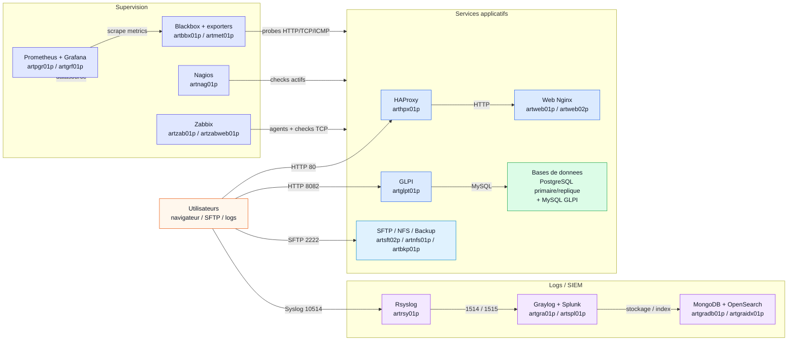
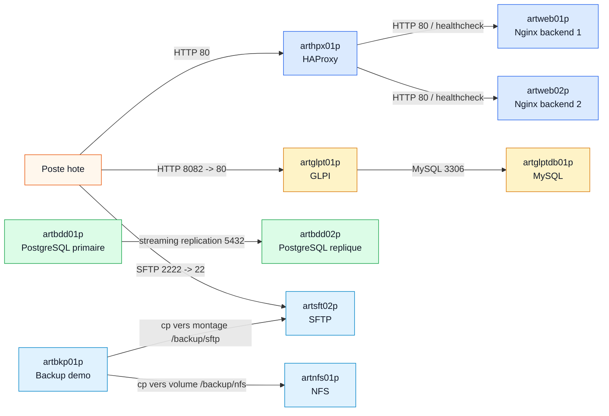
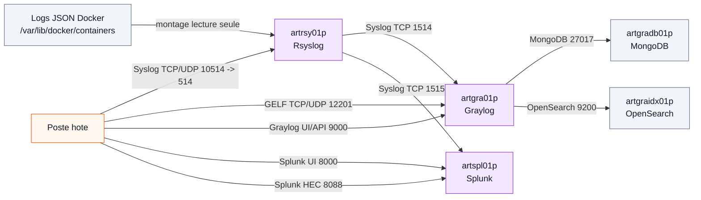
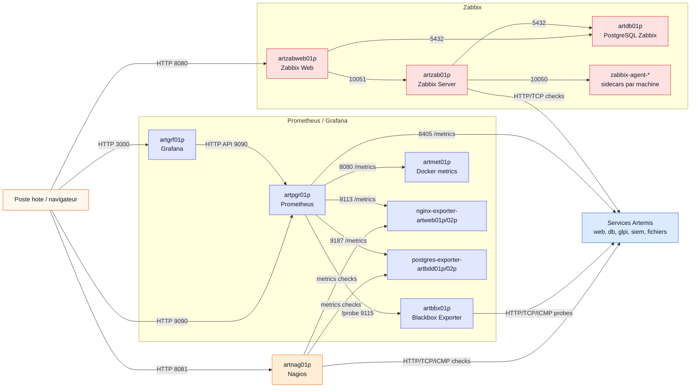
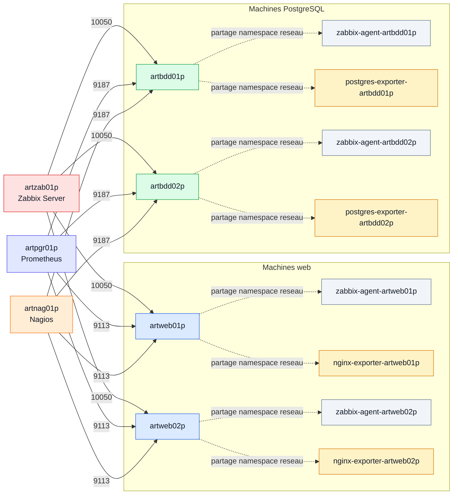
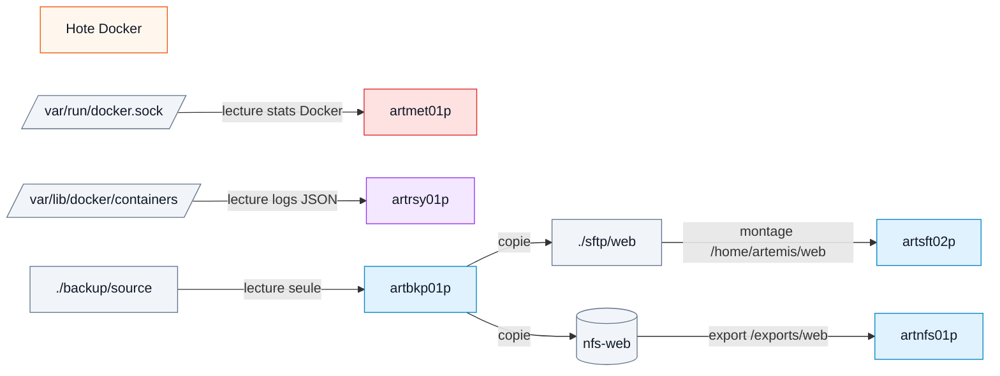
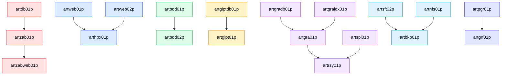

# Schema des flux entre conteneurs Artemis

Ce document decrit les flux reseau et les dependances principales de la maquette Docker Compose Artemis. Les volumes Docker et montages locaux sont separes des flux reseau, car ils ne passent pas par le reseau `artemis`.

Code couleur utilise dans les schemas :

| Couleur | Domaine |
|---|---|
| Orange | Acces depuis l'hote Docker / navigateur |
| Bleu | Frontend web et services applicatifs |
| Vert | Bases de donnees |
| Jaune | ITSM ou exporters |
| Cyan | Services fichiers et sauvegarde |
| Violet | Logs / SIEM |
| Rouge | Zabbix et supervision active |
| Indigo | Prometheus / Grafana |
| Gris | Stockage, montages et sidecars techniques |

## 1. Vue globale concise pour slide

Cette version tient sur une slide : les conteneurs sont regroupes par domaine et seuls les flux essentiels sont affiches.

Export PNG 16:9 : [Livrables/Vue Globale Slide 16-9.png](Livrables/Vue%20Globale%20Slide%2016-9.png).

## 2. Flux applicatifs

| Source | Destination | Port / protocole | Rôle |
|---|---|---|---|
| Poste hote | `arthpx01p` | HTTP `80` | Entree web de la maquette |
| `arthpx01p` | `artweb01p` | HTTP `80` | Routage backend HAProxy |
| `arthpx01p` | `artweb02p` | HTTP `80` | Routage backend HAProxy |
| Poste hote | `artglpt01p` | HTTP `8082 -> 80` | Acces GLPI |
| `artglpt01p` | `artglptdb01p` | MySQL `3306` | Base de donnees GLPI |
| `artbdd01p` | `artbdd02p` | PostgreSQL `5432` | Replication primaire vers replique |
| Poste hote | `artsft02p` | SFTP `2222 -> 22` | Acces fichiers |
| `artbkp01p` | `artsft02p` | Montage `./sftp/web` | Copie sauvegarde vers SFTP |
| `artbkp01p` | `artnfs01p` | Volume `nfs-web` | Copie sauvegarde vers NFS |

## 3. Flux logs / SIEM

| Source | Destination | Port / protocole | Rôle |
|---|---|---|---|
| Poste hote | `artrsy01p` | Syslog TCP/UDP `10514 -> 514` | Injection de logs de test |
| `/var/lib/docker/containers` | `artrsy01p` | Montage lecture seule | Lecture des logs JSON Docker |
| `artrsy01p` | `artgra01p` | Syslog TCP `1514` | Transmission vers Graylog |
| `artrsy01p` | `artspl01p` | Syslog TCP `1515` | Transmission vers Splunk |
| Poste hote | `artgra01p` | GELF TCP/UDP `12201` | Entree GELF Graylog |
| Poste hote | `artgra01p` | HTTP `9000` | Interface/API Graylog |
| Poste hote | `artspl01p` | HTTP `8000` | Interface Splunk |
| Poste hote | `artspl01p` | HTTP `8088` | Splunk HEC |
| `artgra01p` | `artgradb01p` | MongoDB `27017` | Metadata Graylog |
| `artgra01p` | `artgraidx01p` | HTTP `9200` | Indexation OpenSearch |

## 4. Flux supervision

| Source | Destination | Port / protocole | Rôle |
|---|---|---|---|
| Poste hote | `artzabweb01p` | HTTP `8080` | Interface Zabbix |
| `artzabweb01p` | `artzab01p` | Zabbix `10051` | Dialogue web vers serveur Zabbix |
| `artzabweb01p` | `artdb01p` | PostgreSQL `5432` | Donnees UI Zabbix |
| `artzab01p` | `artdb01p` | PostgreSQL `5432` | Base serveur Zabbix |
| `artzab01p` | `zabbix-agent-*` | Agent `10050` | Collecte metriques systeme |
| `artzab01p` | services supervises | HTTP/TCP | Items applicatifs simples |
| Poste hote | `artnag01p` | HTTP `8081 -> 80` | Interface Nagios |
| `artnag01p` | services supervises | HTTP/TCP/ICMP | Checks actifs Nagios |
| Poste hote | `artpgr01p` | HTTP `9090` | Interface Prometheus |
| Poste hote | `artgrf01p` | HTTP `3000` | Interface Grafana |
| `artgrf01p` | `artpgr01p` | HTTP `9090` | Datasource Grafana |
| `artpgr01p` | `artbbx01p` | HTTP `9115 /probe` | Probes Blackbox |
| `artbbx01p` | services supervises | HTTP/TCP/ICMP | Verification externe des services |
| `artpgr01p` | `artmet01p` | HTTP `8080 /metrics` | Metriques Docker |
| `artpgr01p` | `artbkp01p` | HTTP `8080 /metrics` | Metriques backup |
| `artpgr01p` | `artweb01p` / `artweb02p` | HTTP `9113 /metrics` | Metriques Nginx via exporters sidecars |
| `artpgr01p` | `artbdd01p` / `artbdd02p` | HTTP `9187 /metrics` | Metriques PostgreSQL via exporters sidecars |
| `artpgr01p` | `arthpx01p` | HTTP `8405 /metrics` | Metriques HAProxy |

## 5. Sidecars Zabbix et exporters

Les sidecars ci-dessous utilisent `network_mode: service:<machine>`. Ils ne possedent donc pas leur propre adresse IP sur le reseau Compose : ils partagent la pile reseau de la machine cible.

Liste des sidecars Zabbix :

| Sidecar | Machine cible |
|---|---|
| `zabbix-agent-artdb01p` | `artdb01p` |
| `zabbix-agent-artzab01p` | `artzab01p` |
| `zabbix-agent-artzabweb01p` | `artzabweb01p` |
| `zabbix-agent-artweb01p` | `artweb01p` |
| `zabbix-agent-artweb02p` | `artweb02p` |
| `zabbix-agent-arthpx01p` | `arthpx01p` |
| `zabbix-agent-artbdd01p` | `artbdd01p` |
| `zabbix-agent-artbdd02p` | `artbdd02p` |
| `zabbix-agent-artglptdb01p` | `artglptdb01p` |
| `zabbix-agent-artglpt01p` | `artglpt01p` |
| `zabbix-agent-artgradb01p` | `artgradb01p` |
| `zabbix-agent-artgraidx01p` | `artgraidx01p` |
| `zabbix-agent-artgra01p` | `artgra01p` |
| `zabbix-agent-artspl01p` | `artspl01p` |
| `zabbix-agent-artrsy01p` | `artrsy01p` |
| `zabbix-agent-artsft02p` | `artsft02p` |
| `zabbix-agent-artnfs01p` | `artnfs01p` |
| `zabbix-agent-artbkp01p` | `artbkp01p` |
| `zabbix-agent-artbbx01p` | `artbbx01p` |
| `zabbix-agent-artmet01p` | `artmet01p` |
| `zabbix-agent-artpgr01p` | `artpgr01p` |
| `zabbix-agent-artgrf01p` | `artgrf01p` |
| `zabbix-agent-artnag01p` | `artnag01p` |

Liste des exporters sidecars :

| Exporter | Machine cible | Port expose dans le namespace cible |
|---|---|---:|
| `nginx-exporter-artweb01p` | `artweb01p` | `9113` |
| `nginx-exporter-artweb02p` | `artweb02p` | `9113` |
| `postgres-exporter-artbdd01p` | `artbdd01p` | `9187` |
| `postgres-exporter-artbdd02p` | `artbdd02p` | `9187` |

## 6. Flux de stockage et montages

| Source | Destination | Type | Rôle |
|---|---|---|---|
| `/var/run/docker.sock` | `artmet01p` | Montage lecture seule | Collecte etat CPU/RAM/reseau/disque des conteneurs |
| `/var/lib/docker/containers` | `artrsy01p` | Montage lecture seule | Lecture des logs JSON Docker |
| `./backup/source` | `artbkp01p` | Montage lecture seule | Source de sauvegarde |
| `artbkp01p` | `./sftp/web` | Montage fichier | Destination sauvegarde SFTP |
| `./sftp/web` | `artsft02p` | Montage fichier | Dossier expose en SFTP |
| `artbkp01p` | `nfs-web` | Volume Docker | Destination sauvegarde NFS |
| `nfs-web` | `artnfs01p` | Volume Docker | Donnees exportees par NFS |

## 7. Dependances de demarrage principales

Ces dependances correspondent aux `depends_on` principaux du `docker-compose.yml`. Les sidecars Zabbix et exporters dependent aussi de leur machine cible.
